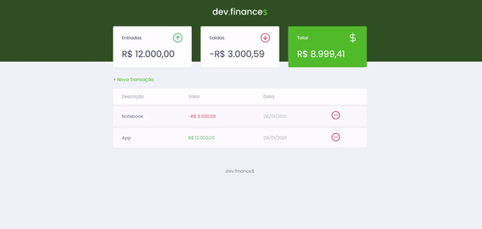

<h3 align="center">
    
</h3>

<p align="center"> 💲 <strong>Dev.Finances - Maratona Discover</strong> 🚧 </p>
 
<br>

<p align="center">
   
  
  <a href="https://github.com/savio-2-lopes">
    
  </a>
 
 <a href="https://github.com/savio-2-lopes">
    
  </a>
</p>

<br> 

## :pushpin: Índice

- [Sobre](#sobre-o-projeto)
- [Layout](#layout)
- [Tecnologias](#tecnologias)
- [Como Executar](#executar)
- [Licença](#licenca)
- [Autor](#autor)
- [Agradecimentos](#agradecimento)

<br>

<a id="sobre-o-projeto"></a>

## 💻 Sobre o projeto

💲 Dev.Finances - É um projeto feito para testar conhecimentos de Frontend.

Projeto desenvolvido durante a **Imersão Discover** oferecida pela [Rocketseat](https://rocketseat.com.br/).

<br>

<a id="layout"></a>

## 🎨 Layout

<p align="center" style="display: flex; align-items: flex-start; justify-content: center;">
  
</p>

AIzaSyA6tvkgbUIPp3nLEJMGb8EWXZ
<br>

<a id="tecnologias"></a>

## 🛠 Tecnologias utilizadas
* [HTML](https://developer.mozilla.org/pt-BR/docs/Web/HTML)
* [CSS](https://developer.mozilla.org/pt-BR/docs/Web/CSS)
* [Javascript](https://developer.mozilla.org/pt-BR/docs/Web/JavaScript)

<br>

<a id="executar"></a>

## 🚀 Como executar o projeto

Para executar a aplicação é bom ter um editor para trabalhar com o código como [VSCode](https://code.visualstudio.com/).

<br>

#### :octocat: Faça o clone do projeto

```bash
# Clone este repositório
$ git clone https://github.com/savio-2-lopes/dev.finaces.git

# Acesse a pasta do projeto no terminal/cmd
$ cd dev.finaces

```

<br>

<a id="licenca"></a>

## :memo: Licença

Este projeto está sob a licença do MIT. Veja a [página de licença](https://opensource.org/licenses/MIT) para mais detalhes.

<br>

<a id="autor"></a>

## 🦸 Autor
        
[](https://www.linkedin.com/in/savio-lopes/) 
[](https://github.com/savio-2-lopes)
[](https://api.whatsapp.com/send?phone=12996798894&text=Hello!)
[](mailto:savioaugulopes@gmail.com)

Feito com ❤️ por Savio Lopes 👋🏽 [Entre em contato!](https://www.linkedin.com/in/savio-lopes/)

<br>

<a id="agradecimento"></a>

## 💙  Agradecimentos
Obrigado [Rocketseat](https://rocketseat.com.br/) por disponibilizar esse conteúdo sensacional 🚀.
